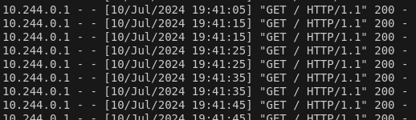
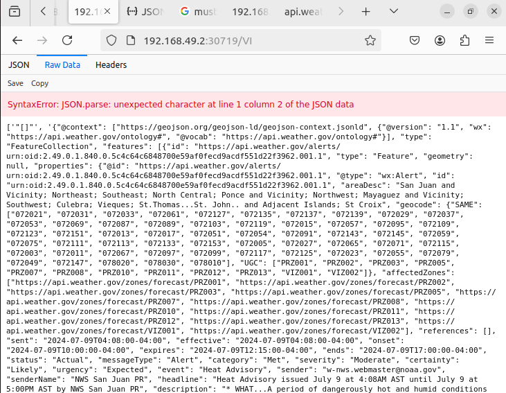
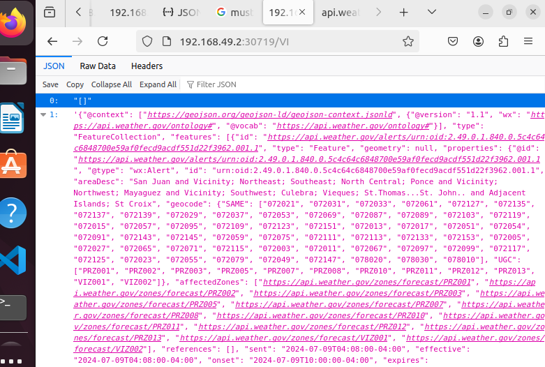

The first step was to containerise the flask python3 application using a Dockerfile so it can be distributed using k8s. It is worth noting that I defined a command to listen on all ports 0.0.0.0 which is sufficient for this exercise but could _potentially_ pose a risk if an app/microservice is only meant to be accessed in own infrastructure. If an application made available to the public is to be secured, services like ALB on AWS with a CDN such as CloudFront with AWS WAF built in could be some examples of keeping it more secure on a network. This is also a simple Dockerfile, in practice I would use a multistage Dockerfile for larger and more complex applications as this will also lower the attack surface.

I built this locally `docker build . -t orangewave698/birdapp:${version_number}` and tested in the browser with localhost and the the port I defined as 3000 to ensure this image when ran as a container would work. I then pushed this to docker hub to make use of a remote repository for this application image as a best practice. In production however, I would use a cloud native registry store such as ECR for AWS or Google Container Registry in GCP or at least make sure that I am not using a public registry (credentials can be included in helm charts for auth with a private registry).

Next was to define what values helm would pull through to deploy this application, as template files contain references to pickup values from this- the image to be pulled was specified as our built image. 
This application then needed a k8s service to expose it, so NodePort was defined so it could be accessed from outside the cluster. In the actual service.yaml, a selector was specified for telling the service which application to access. The application to access was retrieved by running `helm template <whatever_I_called_the_chart> <path_to_chart>` in this case, `helm template birds birds/` - this command lists what will be deployed in the manifest when `helm install/upgrade` is ran and shows populated values for the possible selectors as labels. This was key to specifying how to expose the application and access it in a web browser. If deployed without this selector, the logs `logs -f <pod_name_with_app_container>` (can also use k9s for interactive log exploration) would return a GET 200 on the http request (as we demonstrated that the containerised app worked) but would not be accessible in the browser as no service existed to expose it. I also amended the liveness and readiness probes delay to give time for the application to standup.

To actually run the helm install, minikube was used as a custom cluster as this is what I am most familiar with. 

After running `minikube start`, a cluster is spun up for us to deploy the application and associated services into (it also includes a dashboard gui you can run for visualisation).

The helm chart was successfully deployed using `helm install birds birds/` when changed directory into `helm/birds`. Running a `helm list` will display it.

The IP address can be obtained by running the handy command in the NOTES.txt but can also be obtained by running `minikube ip` and then adding the NodePort value of the service to this (effectively what the env export commands in the notes file fetch) as we are looking for the facing IP address of the cluster to access what's inside and what has been exposed by the service. 

After accessing this in a browser and navigating to the file path of `/<state>` I noticed an issue with the app.py itself when accessed within a browser.

I had a look at the app.py and noticed that the `get_weather` function was referencing an `${abbreviation}` variable, however what we defined as the variable in the previous function was `${state}` so this was amended. This then fetched the information we were expecting from the URL defined in the function `https://api.weather.gov/alerts/active?area={state}`. 

A json parse error still existed and this is because the GET defined a string conversion for the birds and weather fetched, so this was amended to json. I did also check the syntax of the response in a json linter to better visualize what we were expecting (string spits out singles quotes and not double). This then rid of the error and the json was returned when accessing that path. 

ADDITIONS:

Because it is ran locally using minikube, a NodePort service was sufficient to access this application in a browser, however in production an ingress should be defined to access this service. An ingress controller like nginx-ingress-controller could be defined as a reverse proxy to access this application and assign an external IP address and DNS (a DNS record would need to be created and the domain then specified in the ingress file as host, route53 in AWS can issue DNS records too), the service for the app could then be defined as a ClusterIP, the ingress set to true in the values.yaml and annotation of rewrite target adjusted and a capture group given on the ingress rule path. TLS could also be defined at this layer to securely access the cluster using https through a tls handshake. The controller could be deployed in a separate namespace to separate the application (useful for when running `kubectl get all` to see what has been deployed). A separate helm chart could be created to deploy this but then the ingress will need to point to the application pod. TLS would mean issuing ssl certificates which can be issued by installing cert-manager (acme server could issue these) defining a CA. These can then be stored and accessed in k8s or they could alternatively be stored in a secure location like Hashicorp Vault and (secrets can also be injected using a vault sidecar) or a cloud native keystore like KMS in AWS or KMS in GCP. Nginx could also be used as a load balancer to distribute client request across instances (could scale up the replicas of application pod) or a load balancer can be specified if running in the cloud. This can be defaulted if cloud provider managed k8s instances are deployed. 

I would also include some stack for monitoring e.g. a prometheus database for the logging and grafana for visualisation.
A prometheus operator would need to be installed onto the cluster and RBAC permissions would need to be set for this. Prometheus would then be exposed as a ServiceMonitor so that prometheus scrapes its own metrics endpoint. Then prometheus can be set to true in the application's values yaml.

The liveness and readiness probe's endpoints could also be changed to healthchecks when after the healthchecks are configured.

A hpa would also be good to have in production so that the application can scale appropriately if it is serving high traffic- rules and number of pods can be configured accordingly. 